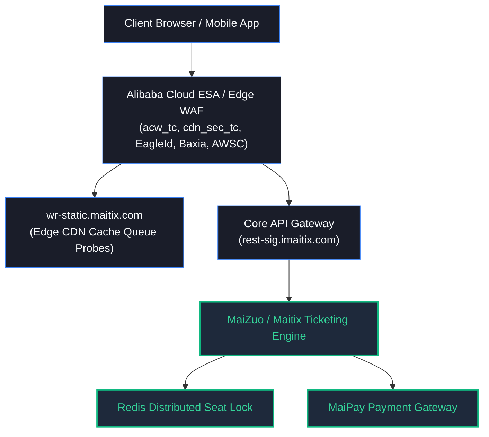
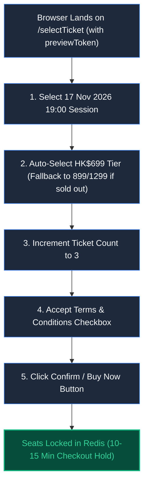

# HK Ticketing (hkticketing.com) System Architecture, Reverse Engineering Study & Pro Ticketing Client

> A comprehensive deep-dive reverse engineering study of **HK Ticketing (Hong Kong Ticketing / 快達票, hkticketing.com)** modern cloud-native architecture powered by Alibaba Cloud (Aliyun) and MaiZuo / Maitix (Damai enterprise ticketing platform). Includes an active high-concurrency desktop client and a browser companion userscript.

---

## 📑 Table of Contents
1. [Overview & Architecture](#-overview--architecture)
2. [Key Reverse Engineering Discoveries](#-key-reverse-engineering-discoveries)
3. [Repository Structure](#-repository-structure)
4. [Technical Documentation Index (`tech-docs/`)](#-technical-documentation-index-tech-docs)
5. [HK Ticketing Pro Client Application (`client-app/`)](#-hk-ticketing-pro-client-application-client-app)
6. [Tampermonkey Auto-Pick & Fast-Lock Userscript](#-tampermonkey-auto-pick--fast-lock-userscript)
7. [Installation & Getting Started](#-installation--getting-started)
8. [Production Operational Playbook (Kai Tak Stadium 2026 Edition)](#-production-operational-playbook)
9. [Disclaimer & Security Research Ethics](#-disclaimer--security-research-ethics)

---

## 🏛 Overview & Architecture

HK Ticketing transitioned away from legacy ticketing infrastructures onto Alibaba Cloud’s enterprise ticketing ecosystem (**iMaitix / Damai / MaiZuo**). The frontend is built on **UmiJS + React SPA**, distributed across **Alibaba Cloud ESA (Edge Security Acceleration) CDN**, with edge WAF proxies fronting the core API gateway at `rest-sig.imaitix.com`.



---

## 🔍 Key Reverse Engineering Discoveries

### 1. Dual-Track Queue & Adaptive Degrade Engine (`waitingRoom.js`)
Unlike platforms that use simple periodic HTTP polling, HK Ticketing implements a sophisticated dual-track queue:
* **Track 1 (Edge CDN Static Probe)**: Requests `https://wr-static.maitix.com/check?projectId={projectId}&cp={progress}` with custom `X-User-Id` header. Hits edge cache directly to protect core database systems under flash-crowd load.
* **Track 2 (Dynamic Qualified Query)**: Hits `/api/waitingRoom/queryQualified?projectId={projectId}&infoToken={infoToken}`.
* **Degrade Load State Machine**: When the edge returns `degradeLoad: true`, the client smoothly switches intervals between `loadStart`, `loadCycle`, `degradeLoadStart`, and `degradeLoadCycle` with randomized backoff jitter.

### 2. Browser Tab Mutex Lock (`WAITINGROOM_ACTIVE_TAB_`)
* Stores `{ tabId, timestamp }` under key `WAITINGROOM_ACTIVE_TAB_{projectId}` in `localStorage`.
* Heartbeat renewed every **5,000ms**; allows takeover after a **15,000ms** expiration.
* Actively listens to `window.addEventListener('storage')` and `document.addEventListener('visibilitychange')`.
* Opening multiple tabs in the same browser results in instant queue invalidation and eviction.

### 3. Queue Pass Hand-off Protocol (`previewToken`)
* Upon queue qualification, the queue response releases a signed JWT `previewToken` (and optional `visibleToken`).
* The user transitions from the waiting room to the ticket selection route with query parameters:
  ```text
  https://hkt.hkticketing.com/en/#/allEvents/detail/selectTicket?activityId={projectId}&previewToken={previewToken}
  ```
* Bypassing headless seat-selection prevents triggering Alibaba Cloud Baxia slider captchas and 3D-Secure card verification failures.

---

## 📂 Repository Structure

```text
hkticketing-study/
├── .gitignore                           # Git ignore rules for node_modules, build & secrets
├── README.md                            # Comprehensive project overview and architecture documentation
├── tampermonkey-hkt-fastlock.user.js    # Browser companion userscript for instant seat pick & lock
├── tech-docs/                           # Detailed technical reverse-engineering reports
│   ├── 01-architecture-overview.md      # Maitix / Damai infrastructure, WAF topology & edge CDN
│   ├── 02-routing-and-chunks.md         # UmiJS routes, chunk manifests & bundle analysis
│   ├── 03-waiting-room-and-queue-protocol.md # Dual-track edge probe & dynamic degrade engine
│   ├── 04-tab-mutex-and-session-security.md # Single-tab mutex lock & storage listener bypass
│   ├── 05-ticketing-stages-and-payment.md   # State machine, seat hold timer & MaiPay polling
│   ├── 06-waf-sec-and-telemetry.md      # Alibaba AWSC, Baxia captcha & Aplus analytics
│   └── 07-client-app-implementation-plan.md # Multi-slot desktop client architecture
├── client-app/                          # High-concurrency desktop queuing client
│   ├── index.html                       # Application shell (Title: hkticketing)
│   ├── vite.config.ts                   # Vite configuration with reverse proxy for Aliyun API
│   ├── public/                          # Public static assets & downloadable userscripts
│   └── src/
│       ├── App.tsx                      # Primary tactical HUD, live telemetry stream & controls
│       ├── services/
│       │   ├── eventService.ts          # Clock calibration & event metadata service
│       │   ├── slotManager.ts           # Multi-slot concurrency manager with independent sessions
│       │   └── waitingRoomEngine.ts     # Dual-track queue probe with degrade load handling
│       └── types/                       # TypeScript interfaces for EventDetail, Slots & Tokens
└── probe_*.js / fetch_*.js              # Node.js investigative scripts for API probing & verification
```

---

## 📚 Technical Documentation Index (`tech-docs/`)

| File | Topic & Focus Area |
| :--- | :--- |
| [`01-architecture-overview.md`](tech-docs/01-architecture-overview.md) | Network topology, Alibaba Cloud ESA CDN, Maitix engine integration. |
| [`02-routing-and-chunks.md`](tech-docs/02-routing-and-chunks.md) | UmiJS dynamic chunks, code splitting, and frontend route maps. |
| [`03-waiting-room-and-queue-protocol.md`](tech-docs/03-waiting-room-and-queue-protocol.md) | In-depth breakdown of `waitingRoom.js`, token validation, and edge polling. |
| [`04-tab-mutex-and-session-security.md`](tech-docs/04-tab-mutex-and-session-security.md) | Reverse-engineered `WAITINGROOM_ACTIVE_TAB_` mutex algorithm and circumvention. |
| [`05-ticketing-stages-and-payment.md`](tech-docs/05-ticketing-stages-and-payment.md) | Seat reservation lifecycle, 15-minute hold timer, and MaiPay callback polling. |
| [`06-waf-sec-and-telemetry.md`](tech-docs/06-waf-sec-and-telemetry.md) | Analysis of AWSC fingerprinting, Baxia slider hooks, and Aplus analytics. |
| [`07-client-app-implementation-plan.md`](tech-docs/07-client-app-implementation-plan.md) | Blueprint for building the multi-slot desktop queuing client. |

---

## ⚡ HK Ticketing Pro Client Application (`client-app/`)

The client application is built with **Vite + React 19 + TypeScript + Lucide-react**, designed to operate on **Port 6006**.

### Core Capabilities:
1. **Multi-Slot Concurrency (Recommended: 3 Slots)**:
   * Generates isolated virtual `tabId` sessions (`tab_xxxxxx`) per slot.
   * Completely bypasses the official `WAITINGROOM_ACTIVE_TAB_` mutex eviction mechanism.
   * Multiplies queue placement probability by 3x while strictly staying under office/CGNAT IP rate-limit thresholds.
2. **Server Clock Calibration**:
   * Synchronizes against Alibaba Cloud server timestamps with millisecond accuracy.
   * Displays independent countdown timers for Waiting Room opening and Public Sale release.
3. **Dual Gateway Modes**:
   * `● LIVE PROXY`: Direct proxying to `https://rest-sig.imaitix.com` via Vite development server with authentic Origin/Referer headers.
   * `SIMULATION`: Local simulation mode for testing state transitions, sound cues, and hand-off mechanics.
4. **Automated Token Capture & Handoff**:
   * Captures `previewToken` the millisecond the server qualifies any slot.
   * Generates direct authorized URLs bypassing the waiting room entirely.
   * Supports one-click **`[Copy Link]`** / **`[Copy URL]`** and automatic browser hand-off (`AUTO-BUY: ON`).
5. **Rehearsal Controls**:
   * ⏩ **FastForward Icon**: Instantly forces the countdown to zero to simulate a live release event.
   * 🔄 **RotateCcw Icon**: Resets the clock to the official scheduled sale countdown.

---

## 🐒 Tampermonkey Auto-Pick & Fast-Lock Userscript

* **File Location**: [`tampermonkey-hkt-fastlock.user.js`](tampermonkey-hkt-fastlock.user.js)
* **Version**: `v1.2.0`
* **Target Project ID**: `50000001568003`
* **Target Session**: `17 Nov 2026 (Tuesday) 19:00`
* **Ticket Quantity**: `3 Tickets`
* **Tier Priority Ladder**:
  1. 🥇 **Priority 1**: `HK$699 (RV - Restricted View)`
  2. 🥈 **Priority 2**: `HK$899`
  3. 🥉 **Priority 3**: `HK$1,299`

### Execution Lifecycle:


---

## 🚀 Installation & Getting Started

### Prerequisites
* **Node.js**: v18.0.0 or higher
* **Package Manager**: npm (bundled with Node.js)
* **Browser**: Chrome / Edge / Brave with [Tampermonkey](https://www.tampermonkey.net/) installed

### 1. Clone the Repository
```bash
git clone https://github.com/billy1030/hkticketing-study.git
cd hkticketing-study
```

### 2. Run the Client Application
```bash
cd client-app
npm install
npm run dev
```
Open **[http://localhost:6006/](http://localhost:6006/)** in your browser.

### 3. Install the Companion Userscript
* Click the blue **`Install Userscript`** button in the top navigation bar of the client app, or directly open `tampermonkey-hkt-fastlock.user.js` in Tampermonkey.
* Confirm that the script version is **v1.2.0**.

---

## 🎯 Production Operational Playbook

| Timeline | Action | Description |
| :--- | :--- | :--- |
| **Pre-Sale** | **Login & Verify** | Log into your HK Ticketing account on [hkt.hkticketing.com](https://hkt.hkticketing.com) in the browser where Tampermonkey is installed. |
| **T-15 Minutes** | **Prepare Slots** | Open [http://localhost:6006/](http://localhost:6006/). Ensure **3 Slots** are created and mode is set to **`● LIVE PROXY`** with **`AUTO-BUY: ON`**. |
| **T-5 Seconds** | **Launch Queue** | 5 seconds before the waiting room opens, click **`Start All Slots`**. |
| **On Queue Open** | **Edge Engagement** | All 3 slots will establish individual queue positions with randomized jitter to prevent rate-limiting. |
| **On Sale Release** | **Auto-Lock & Pay** | Upon qualification, the app plays an audio chime, captures `previewToken`, and launches the ticket selection page. The userscript completes seat selection in <50ms. Proceed to manual payment. |

---

## ⚖️ Disclaimer & Security Research Ethics

This repository and its contents are published strictly for **academic study, performance evaluation, and educational reverse-engineering purposes**. 

* The research analyzes public web standards, client-side JavaScript bundles, and CDN behaviors.
* Users are responsible for adhering to the Terms of Service of ticketing platforms.
* The authors do not endorse or encourage unauthorized automated ticket harvesting or commercial scalping activities.
